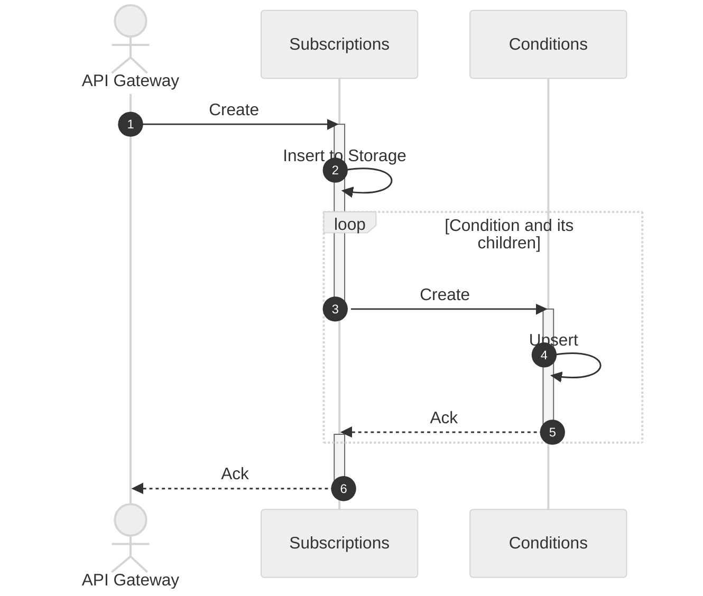
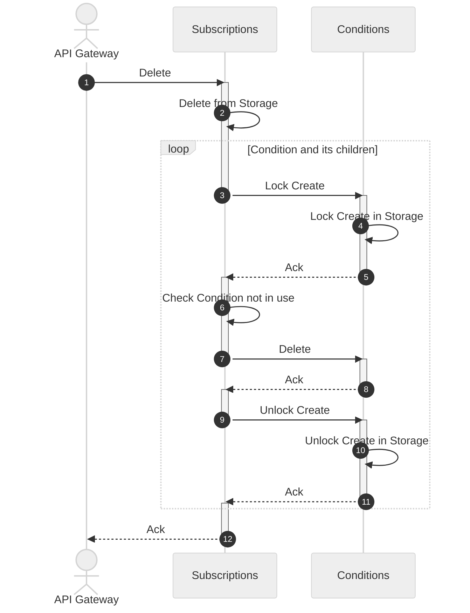

# Contents

1. [Overview](#1-overview)<br/>
   1.1. [Purpose](#11-purpose)<br/>
   1.2. [Definitions](#12-definitions)<br/>
   &nbsp;&nbsp;&nbsp;1.2.1. [Condition](#121-condition)<br/>
   &nbsp;&nbsp;&nbsp;&nbsp;&nbsp;&nbsp;1.2.1.1. [Group Condition](#1211-group-condition)<br/>
   &nbsp;&nbsp;&nbsp;&nbsp;&nbsp;&nbsp;1.2.1.2. [Key Condition](#1212-key-condition)<br/>
   &nbsp;&nbsp;&nbsp;&nbsp;&nbsp;&nbsp;1.2.1.3. [Kiwi Condition](#1213-kiwi-condition)<br/>
   &nbsp;&nbsp;&nbsp;&nbsp;&nbsp;&nbsp;1.2.1.4. [Kiwi Tree Condition](#1214-kiwi-tree-condition)<br/>
   &nbsp;&nbsp;&nbsp;&nbsp;&nbsp;&nbsp;1.2.1.5. [Kiwi Bird Condition](#1215-kiwi-bird-condition)<br/>
   &nbsp;&nbsp;&nbsp;1.2.2. [Subscription](#122-subscription)<br/>
2. [Configuration](#2-configuration)<br/>
3. [Deployment](#3-deployment)<br/>
   3.1. [Prerequisites](#31-prerequisites)<br/>
   3.2. [Bare](#32-bare)<br/>
   3.3. [Docker](#33-docker)<br/>
   3.4. [K8s](#34-k8s)<br/>
   &nbsp;&nbsp;&nbsp;3.4.1. [Helm](#341-helm)<br/>
4. [Usage](#4-usage)<br/>
   4.1. [Create](#41-create)<br/>
   4.2. [Read](#42-read)<br/>
   4.3. [Update Metadata](#43-update-metadata)<br/>
   4.4. [Delete](#44-delete)<br/>
   4.5. [Search](#45-search)<br/>
   &nbsp;&nbsp;&nbsp;4.5.1. [By Condition](#451-by-account)</br>
   &nbsp;&nbsp;&nbsp;4.5.2. [By Account](#452-by-condition)</br>
5. [Design](#5-design)<br/>
   5.1. [Requirements](#51-requirements)<br/>
   5.2. [Approach](#52-approach)<br/>
   &nbsp;&nbsp;&nbsp;5.2.1. [Data Schema](#521-data-schema)<br/>
   &nbsp;&nbsp;&nbsp;&nbsp;&nbsp;&nbsp;5.2.1.1. [Subscription](#5211-subscription)<br/>
   &nbsp;&nbsp;&nbsp;&nbsp;&nbsp;&nbsp;5.2.1.2. [Group Condition](#5212-group-condition)<br/>
   &nbsp;&nbsp;&nbsp;&nbsp;&nbsp;&nbsp;5.2.1.3. [Kiwi Condition](#5213-kiwi-condition)<br/>
   &nbsp;&nbsp;&nbsp;5.2.2 [Flow](#522-flow)<br/>
   &nbsp;&nbsp;&nbsp;&nbsp;&nbsp;&nbsp;5.2.2.1. [Create](#5221-create)<br/>
   &nbsp;&nbsp;&nbsp;&nbsp;&nbsp;&nbsp;5.2.2.2. [Delete](#5222-delete)<br/>
   5.3. [Limitations](#53-limitations)<br/>
6. [Contributing](#6-contributing)<br/>
   6.1. [Versioning](#61-versioning)<br/>
   6.2. [Issue Reporting](#62-issue-reporting)<br/>
   6.3. [Building](#63-building)<br/>
   6.4. [Testing](#64-testing)<br/>
   &nbsp;&nbsp;&nbsp;6.4.1. [Functional](#641-functional)<br/>
   &nbsp;&nbsp;&nbsp;6.4.2. [Performance](#642-performance)<br/>
   6.5. [Releasing](#65-releasing)<br/>

# 1. Overview

Subscriptions storage service.

## 1.1. Purpose

The purpose is to serve both public subscriptions API (CRUD + Search) and internal Search.

The main internal function of the service is to find all subscriptions by a condition. For example, a message metadata 
is matching a certain pattern. Then it's necessary to find all subscriptions those have this pattern in the 
corresponding condition.

## 1.2. Definitions

### 1.2.1. Condition

A condition represents a message matching criteria. The common property for any type of condition is a negation flag 
(`Not`). When the negation flag set to `true` the condition is treated as a negation, otherwise it's a proposition.

#### 1.2.1.1. Group Condition

A group condition represents a group of child conditions coupled with a certain logic: `And`, `Or`, `Xor`.

#### 1.2.1.2. Key Condition

A key condition is an abstract condition specifying a key that should match the message metadata key. Also has a unique
condition id.

#### 1.2.1.3. Kiwi Condition

A kiwi (Key-Input WIldcard) condition is a key condition containing the metadata value pattern. Also, kiwi condition has
a `partial` attribute to represent whether a value part is allowed to match the pattern.

#### 1.2.1.4. Kiwi Tree Condition

A [kiwi-tree](https://github.com/awakari/kiwi-tree) specific condition implementation of a kiwi condition.
It comes with additional [limitations](https://github.com/awakari/kiwi-tree#53-limitations) on the 
[pattern syntax](https://github.com/awakari/kiwi-tree#122-pattern) but allows resolving a condition by a key/value pair 
in a O(log(N)) time.

#### 1.2.1.5. Kiwi Bird Condition

A specific kiwi condition implementation. It should come without any limitation on the pattern syntax but will resolve a 
condition in O(N) time. Not implemented yet. 

### 1.2.2. Subscription

Subscription is an entity linking the message matching [condition](#121-condition) with the user account. 
A subscription also has:
* unique id generated on creation
* human-readable description

# 2. Configuration

The service is configurable using the environment variables:

| Variable                   | Example value                                          | Description                                                                       |
|----------------------------|--------------------------------------------------------|-----------------------------------------------------------------------------------|
| API_PORT                   | `50051`                                                | gRPC API port                                                                     |
| DB_URI                     | `mongodb+srv://localhost/?retryWrites=true&w=majority` | DB connection URI                                                                 |
| DB_NAME                    | `subscriptions`                                        | DB name to store the data                                                         |
| DB_USERNAME                | `subscriptions`                                        | DB connection username                                                            |
| DB_PASSWORD                | `subscriptions`                                        | DB connection password                                                            |
| DB_TABLE_NAME              | `subscriptions`                                        | DB table name to store the data                                                   |
| API_KIWI_TREE_COMPLETE_URI | `kiwi-tree-complete:50051`                             | Complete [kiwi-tree](https://github.com/awakari/kiwi-tree) dependency service URI |
| API_KIWI_TREE_PARTIAL_URI  | `kiwi-tree-partial:50051`                              | Partial [kiwi-tree](https://github.com/awakari/kiwi-tree) dependency service URI  |

# 3. Deployment

## 3.1. Prerequisites

A general note is that there should be a MongoDB cluster deployed to be used for storing the pattern data.
It's possible to obtain a free cluster for testing purposes using [Atlas](https://www.mongodb.com/atlas/database).

## 3.2. Bare

Preconditions:
1. Build patterns executive using ```make build```
2. Run the [kiwi-tree](https://github.com/awakari/kiwi-tree) dependency services (x2: complete/partial)

Then run the command:
```shell
API_PORT=50051 \
DB_URI=mongodb+srv://localhost/\?retryWrites=true\&w=majority \
DB_NAME=subscriptions \
DB_TABLE_NAME=subscriptions \
API_KIWI_TREE_COMPLETE_URI=http://localhost:50051 \
API_KIWI_TREE_PARTIAL_URI=http://localhost:50052 \
./subscriptions
```

## 3.3. Docker

TODO: run the kiwi-tree (x2) and subscriptions in the same network

alternatively, it's possible to build and run the new docker image in place using the command:
(note that the command below requires all env vars to be set in the file `env.txt`)

```shell
make run
```

## 3.4. K8s

TODO

### 3.4.1. Helm

Create a helm package from the sources:
```shell
helm package helm/subscriptions/
```

Install the helm chart:
```shell
helm install subscriptions ./subscriptions-<CHART_VERSION>.tgz \
  --values helm/subscriptions/values-db-uri.yaml
```

where
* `values-db-uri.yaml` contains the value override for the DB URI
* `<CHART_VERSION>` is the helm chart version

# 4. Usage

The service provides basic gRPC interface to perform the operation on subscriptions.

## 4.1. Create

Example command:
```shell
grpcurl \
  -plaintext \
  -proto api/grpc/service.proto \
  -H 'X-Awakari-Group-Id: group0' \
  -H 'X-Awakari-User-Id: user0' \
  -d @ \
  localhost:50051 \
  awakari.subscriptions.Service/Create
```

Payload:
```json
{
   "md": {
      "description": "my subscription 1",
      "enabled": true
   }, 
   "cond": {
      "not": false,
      "gc": {
         "logic": 0, 
         "group": [
            {
               "not": false,
               "ktc": {
                  "key": "key0", 
                  "pattern": "pattern?", 
                  "partial": false
               }
            }, 
            {
               "not": true,
               "ktc": {
                  "key": "key1", 
                  "pattern": "pattern1", 
                  "partial": true
               }
            }
         ]
      }
   }
}
```

## 4.2. Read

Example:
```shell
grpcurl \
  -plaintext \
  -proto api/grpc/service.proto \
  -H 'X-Awakari-Group-Id: group0' \
  -H 'X-Awakari-User-Id: user0' \
  -d '{"id": "17861cda-edc0-4655-be5a-e69a8129aff5"}' \
  localhost:50051 \
  awakari.subscriptions.Service/Read
```

## 4.3. Update Metadata

Example:
```shell
grpcurl \
  -plaintext \
  -proto api/grpc/service.proto \
  -H 'X-Awakari-Group-Id: group0' \
  -H 'X-Awakari-User-Id: user0' \
  -d @ \
  localhost:50051 \
  awakari.subscriptions.Service/UpdateMetadata
```

Payload:
```json
{
   "id": "d3911098-99e7-4a69-94f9-3cea0b236a04",
   "md": {
      "description": "my subscription 1 updated"
   }
}
```

## 4.4. Delete

Example:
```shell
grpcurl \
  -plaintext \
  -proto api/grpc/service.proto \
  -H 'X-Awakari-Group-Id: group0' \
  -H 'X-Awakari-User-Id: user0' \
  -d '{"id": "f7102c87-3ce4-4bb0-8527-b4644f685b13"}' \
  localhost:50051 \
  awakari.subscriptions.Service/Delete
```

## 4.5. Search

### 4.5.1. By Account

The search by metadata purpose is to be used by a user to find own subscriptions.

Example:
```shell
grpcurl \
  -plaintext \
  -proto api/grpc/service.proto \
  -H 'X-Awakari-Group-Id: group0' \
  -H 'X-Awakari-User-Id: user0' \
  -d '{"limit": 100, "cursor": "0123456789abcdef"}' \
  localhost:50051 \
  awakari.subscriptions.Service/SearchOwn
```

### 4.5.2. By Condition

The search by condition purpose is to be used by a [resolver](https://github.com/awakari/resolver) to find the matching 
subscriptions.

Example:
```shell
grpcurl \
  -plaintext \
  -proto api/grpc/private/service.proto \
  -d '{"kcq": {"key": "key0", "pattern": "pattern?", "partial": false}}' \
  localhost:50051 \
  awakari.subscriptions.private.Service/SearchByCondition
```

# 5. Design

## 5.1. Requirements

| #     | Summary           | Description                                                                              |
|-------|-------------------|------------------------------------------------------------------------------------------|
| REQ-1 | Basic matching    | Resolve subscriptions matching the input value                                           |
| REQ-2 | Logic             | Support subscription logics for the multiple key-value matches (*and*, *or*, *not*)      |
| REQ-3 | Partial matching  | Support partial (value might be split to lexemes) value matching                         |
| REQ-4 | Pagination        | Support query results pagination                                                         |
| REQ-5 | On/off switch     | Support subscription disabling for internal query by condition without removing it       |
| REQ-6 | Metadata update   | Support changing a subscription description, priority and enabled flag                   |
| REQ-7 | Authentication    | Authenticate public API calls: `Create`, `Read`, `UpdateMetadata`, `Delete`, `SearchOwn` |

## 5.2. Approach

### 5.2.1. Data Schema

Subscriptions are stored in the single table under the denormalized schema.

Example data:

```yaml
- id: "2f63ea52-a66c-4b93-92f1-12aa2831cd2c"
  descr: Anything related to orders that are not in Helsinki
  enabled: true
  groupId: "group0"
  userId: "user0"
  cond:
    base:
      not: false
    logic: "And"
    group:
    - id: "14cadd71-c662-4f1a-8b0f-3b17dfb107f5"
      base:
        not: false
      partial: true
      key: "subject"
      pattern: "orders"
    - id: "c00e1228-fd78-4761-8f59-fbbfa690b9a9"
      base:
        not: true
      partial: false
      key: "location"
      pattern: "Helsinki"
```

#### 5.2.1.1. Subscription

A subscription is immutable by design, hence there's no update operation for this. If a user wants to change a 
subscription they need to delete it 1st and then create again.

| Attribute | Type                                       | Description                                                             |
|-----------|--------------------------------------------|-------------------------------------------------------------------------|
| id        | String                                     | Subscription UUID (generated on creation)                               |
| groupId   | String                                     | User Group Id                                                           |
| userId    | String                                     | User Id                                                                 |
| descr     | String                                     | Human readable description                                              |
| enabled   | Boolean                                    | Defines whether the subscription is searchable for a condition matching |
| cond      | Condition (currently may be Group or Kiwi) | Message matching root immutable criteria                                |

#### 5.2.1.2. Group Condition

| Attribute | Type                      | Description                                                    |
|-----------|---------------------------|----------------------------------------------------------------|
| not       | Boolean                   | Defines whether the conditions should act as a negation or not |
| logic     | Enum of `And`/`Or`/`Xor`  | Defines the grouping logic for the child conditions            |
| group     | Array of child conditions | Set of conditions in the group                                 |

#### 5.2.1.3. Kiwi Condition

| Attribute | Type    | Description                                                                                                   |
|-----------|---------|---------------------------------------------------------------------------------------------------------------|
| id        | String  | Condition UUID (generated on creation)                                                                        |
| not       | Boolean | Defines whether the conditions should act as a negation or not                                                |
| key       | String  | Metadata key                                                                                                  |
| pattern   | String  | Metadata value matching pattern                                                                               |
| partial   | Boolean | If `true`, then allowed match any lexeme in a tokenized metadata value. Otherwise, entire value should match. |

### 5.2.2. Flow

#### 5.2.2.1. Create



#### 5.2.2.2. Delete




## 5.3. Limitations

| #     | Summary                                    | Description                                                                                                            |
|-------|--------------------------------------------|------------------------------------------------------------------------------------------------------------------------|
| LIM-1 | Root condition negation is not allowed     | A subscription should not have root negation condition. Otherwise the subscription never matches anything in practice. |
| LIM-2 | Optional condition negation is not allowed | TODO: A negation condition in the group with "Or"/"Xor" group logic doesn't have any effect                            |

# 6. Contributing

## 6.1. Versioning

The service uses the [semantic versioning](http://semver.org/).
The single source of the version info is the git tag:
```shell
git describe --tags --abbrev=0
```

## 6.2. Issue Reporting

TODO

## 6.3. Building

```shell
make build
```
Generates the sources from proto files, compiles and creates the `subscriptions` executable.

## 6.4. Testing

### 6.4.1. Functional

```shell
make test
```

### 6.4.2. Performance

TODO

## 6.5. Releasing

To release a new version (e.g. `1.2.3`) it's enough to put a git tag:
```shell
git tag -v1.2.3
git push --tags
```

The corresponding CI job is started to build a docker image and push it with the specified tag (+latest).
